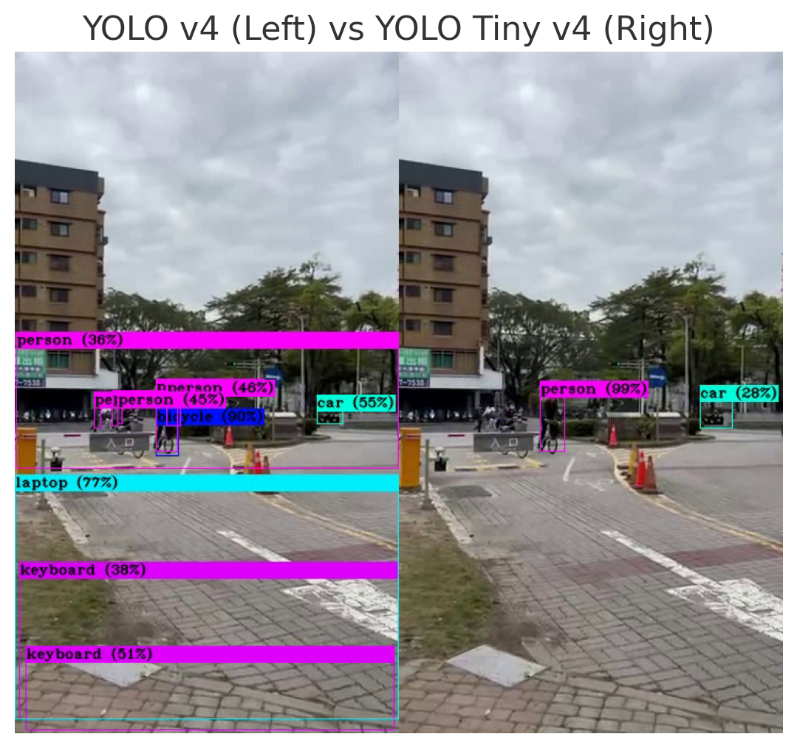

# Generative AI - Coursework Repository

This repository contains my coursework submissions for the **"Generative Artificial Intelligence"** class. It includes **5 homework assignments** and **1 final project**, covering core topics in generative AI such as clustering, association rules, CNNs, GANs, and LLMs.

## 📝 Contents

- `hw1_clustering_classification_association_rules/`
- `hw2_cnn/`
- `hw3_gan/`
- `hw4_llm/`
- `hw5_llm+RAG/`
- `final_project/`

## 🖼️ Static Detection Result

This image shows bounding boxes and labels detected from a real-world scene:

## 📌 Notes

- This repository is **a work in progress** and may continue to be updated.
- Everyone is **welcome to explore, use, or modify** the code for learning and educational purposes.
- Some parts of the code are adapted from **teaching assistants** and **open-source resources**.
