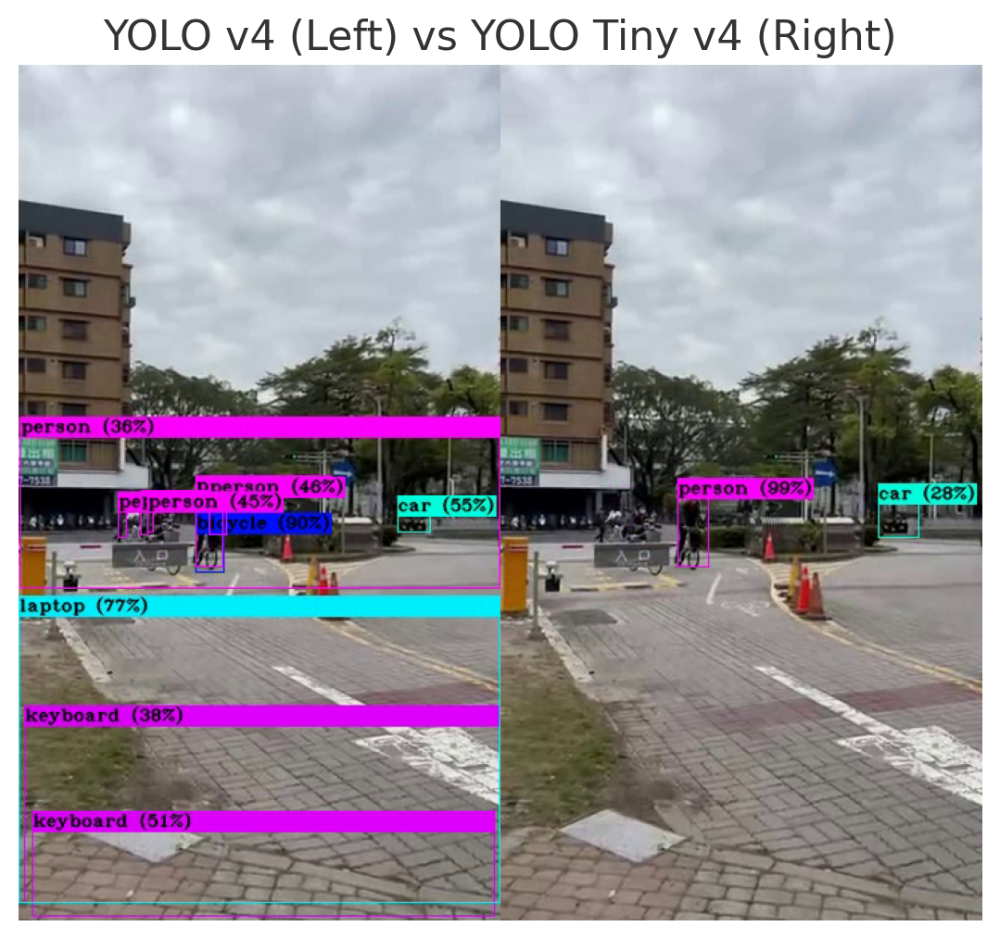

# Generative AI - Coursework Repository

This repository contains my coursework submissions for the **"Generative Artificial Intelligence"** class. It includes **5 homework assignments** and **1 final project**, covering core topics in generative AI such as clustering, association rules, CNNs, GANs, and LLMs.

## 📝 Contents

- [🧠 HW1 - Clustering, Classification, and Association Rules](./hw1_clustering_classification_association_rules/README.md)
- [🧪 HW2 - CNN for Image Classification](./hw2_cnn/README.md)
- [🧬 HW3 - Text Data Augmentation with GAN](./hw3_gan/README.md)
- [💡 HW4 - LLM Fine-Tuning for Churn Prediction](./hw4_llm/README.md)
- [🔎 HW5 - LLM + RAG (Web, PDF, and Dataset QA)](./hw5_llm+RAG/README.md)
- [🎯 Final Project - Object Detection with YOLO]

## 🎞️ Final Project-Object Detecting
Source:https://github.com/achen353/Taiwanese-Traffic-Object-Detection/blob/master/README.md

Here is a short video demonstration of the object detection system:

---

## 📸 YOLO Model Comparison

This image shows bounding boxes and labels detected from a real-world scene using two models:

### YOLO v4 (Left) vs YOLO Tiny v4 (Right)

## 📌 Notes

- This repository is **a work in progress** and may continue to be updated.
- Everyone is **welcome to explore, use, or modify** the code for learning and educational purposes.
- Some parts of the code are adapted from **teaching assistants** and **open-source resources**.
